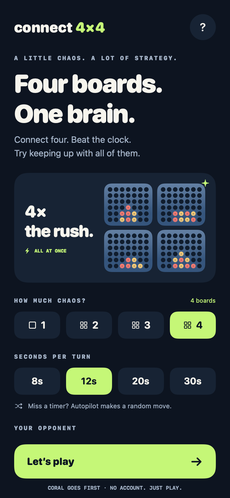
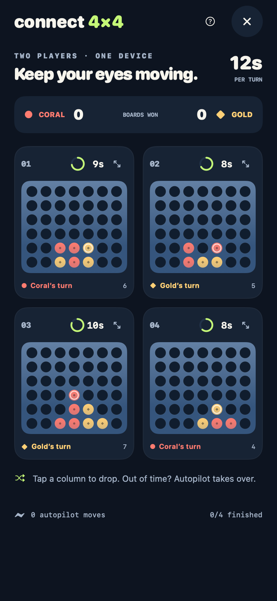

# Connect 4x4

Four boards. One brain. A native iPhone and iPad game where you play one to four games of Connect Four at once, with a separate turn clock on every board. Miss a deadline and autopilot drops a random legal piece for you.

Built with SwiftUI and a standalone Swift rules engine. Play live through Game Center, practice against the computer, or share a device. No app-managed accounts, ads, analytics, custom backend, or third-party runtime dependencies. Online play uses Apple's Game Center account and networking. Open source under the MIT license.

<p>
  
  
</p>

These previews render the real shared SwiftUI views on macOS. Simulator screenshots are attached to the UI test results in Actions.

## Play

Choose 1–4 boards and 8, 12, 20, or 30 seconds per turn. **Online** invites a friend or finds a player through Game Center. **Solo rush** pits Coral against a fast tactical Gold computer. **Local** lets two people share a device. Each board alternates independently; watch its player label and clock. Coral starts every board.

Online players each own one color on all boards. Game Center connects the phones; a deterministic host runs the engine and resolves random timeout moves for both players. The Coral player's chosen board count and turn duration apply. Guest move requests include their expected turn, so duplicate or late requests cannot slip into a later turn. Snapshots carry revisions; clock calibration accounts for device clock differences. The host can start a rematch after results.

Tap a column to drop a piece. Connect four horizontally, vertically, or diagonally to win that board. Most boards won wins the match; equal scores tie. A full board without a winner is a draw. Finished boards stop their clocks.

Every expired turn triggers a uniformly random move among legal columns. A tap at or after expiry is discarded if the timeout already advanced that board. The computer takes wins and blocks immediate threats, then favors the center; it is designed to play quickly rather than to be unbeatable.

Expand any board for larger touch controls, or rotate into landscape for more room. Other timers continue while you focus a board or read the rules. **Stay in the app during online matches:** backgrounding or losing the connection ends the match for both players; there is no host migration or reconnect in this release. Offline matches save locally and resolve missed turns when you return, bounded by the remaining cells. The host is trusted for this casual game, and the wall clock is not an anti-cheat system.

## Build on an iPhone or simulator

Requires **iOS 17+** and **full Xcode 16+**. Apple's command-line tools alone do not include the iOS SDK or simulator.

1. Open `Connect4x4.xcodeproj` and choose the **Connect4x4** scheme.
2. Select an iPhone or iPad simulator and Run.
3. For a physical device, choose your signing team under Signing & Capabilities and select your connected device. The repository contains no signing certificates or provisioning profiles.
4. For online play, enable Game Center for the app identifier, create its matching App Store Connect app record, and test with two different Game Center accounts. Follow [the online setup guide](docs/ONLINE_SETUP.md).

The checked-in project is generated from `project.yml`. After changing project configuration, regenerate it with `brew install xcodegen` and `xcodegen generate`.

```sh
swift test --jobs 3
xcodebuild test -project Connect4x4.xcodeproj -scheme Connect4x4 \
  -destination 'platform=iOS Simulator,name=<your installed iPhone>' \
  CODE_SIGNING_ALLOWED=NO
```

GitHub Actions selects an installed simulator, runs the engine suite and offline UI tests, then compiles a Release build for physical iOS devices without signing. It also tests serialized host/guest matches, stale requests, replayed packets, rematches, and clock skew in the shared online protocol. The simulator `.app` and `.xcresult` test evidence are downloadable as workflow artifacts. An unsigned simulator app is not installable on an iPhone. Game Center's live service requires Apple app configuration and a separate signed two-device check; CI does not certify that service. TestFlight/App Store distribution requires your Apple Developer account and signing.

## Architecture and verification

- `ConnectCore`: a value-type engine with no UI or timers, plus a versioned online packet format and snapshot replica. Injected time and random generators make boundary cases reproducible. Moves are replayed to validate local saves and remote snapshots.
- `ConnectUI`: setup, game, focus, rules, score, and results screens. One task sleeps until the next move deadline or computer move. Countdown display refreshes at 10 Hz; unchanged Canvas boards sit behind an equatable boundary.
- `ConnectUI/OnlineClient.swift`: Game Center authentication, invitations, two-player matchmaking, reliable packets, handshake retries, clock calibration, and connection lifecycle. The guest sends move intents and never runs its own timeout engine.
- `Tests/ConnectCoreTests`: win directions, draws, gravity, full columns, deadline ties, independent clocks, catch-up, invalid saves, computer ownership, 10,000 randomized games, an online host/guest match, stale intents/packets, clock skew, and a catch-up benchmark.
- `UITests`: setup for 1–4 boards, focused input, a complete four-board match, results/rematch, timeout moves, and the solo opponent.

Pieces have distinct center marks as well as colors. Each playable column exposes its stack to VoiceOver. Compact four-board columns on small portrait phones are narrower than a 44-point target; the focus view provides larger columns on standard-size phones. Rules and settings scroll at large text sizes. Physical-device frame time, energy use, VoiceOver usability, and real-world touch latency still need device verification before calling the app production-ready.

On a Mac with a working Swift toolchain, `swift run connect-preview docs/images` renders the shared UI and app icon. `bash scripts/check-local.sh` also compiles directly and runs randomized engine checks if Swift Package Manager is unavailable. Set `CONNECT_SDK` to a matching macOS SDK when needed. This direct-compile fallback currently targets Apple Silicon.

For a playable desktop preview of the same interface, run `bash scripts/build-mac-preview.sh`, then open `.build/Connect4x4.app`. This locally signed Mac preview is a way to try the gameplay while setting up Xcode; iOS is the primary build target.

## Messaging and online play

Live multiplayer uses [Game Center real-time matches](https://developer.apple.com/documentation/gamekit/creating-real-time-games). GamePigeon integration is not implemented: no public integration API was found on its [official site](https://gamepigeonapp.com/). Apple supports a separate [iMessage extension](https://developer.apple.com/imessage/), which could carry invitations in a later release.

## Contributing

Run the engine tests, regenerate the project if configuration changes, and include simulator evidence for UI changes. Keep the engine independent of SwiftUI and preserve the rule that a single expired turn creates exactly one legal move.

Connect 4x4 is an independent project and has no affiliation with GamePigeon or any commercial Connect Four product.
